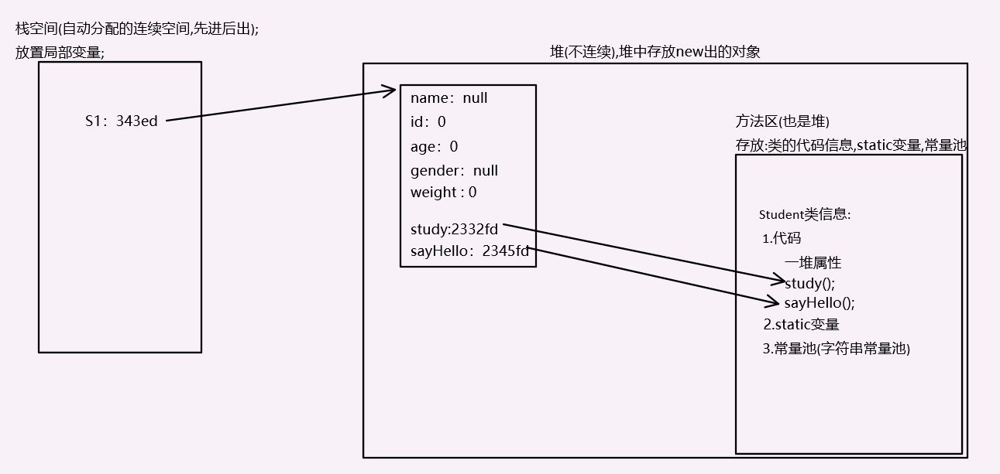

<!-- GFM-TOC -->
* [类和对象的关系](#类和对象的关系)
    * [1. 引用](#1-引用)
    * [2. 内存分析](#2-内存分析)
      * [2.1 组成结构](#21-组成结构)
      * [2.2 演示代码](#22-演示代码)
      * [2.3 图示](#23-图示)
<!-- GFM-TOC -->

# 类和对象的关系
## 1. 引用
```
  Java语言中除了基本类型之外的变量类型都称之为引用类型;
  Java中的对象是通过引用reference对其操作的
  (类似于C++中的指针观念,一个对象引用在栈中的地址指向堆中的实例);
```
## 2.内存分析
### 2.1 组成结构
 - 栈
```
  存放局部变量,先进后出,在内存中连续分配
```
 - 堆
```
 存放new出来的对象;
 线程共享;
```
 - 方法区
```
 关于对方法区的谈论,我们暂时将其理解为在逻辑上属于堆的一部分(但实际上存在差异,以后将会在JVM专题中解释);
 和堆一样,线程共享
 存放:类的信息(代码),static变量,常量池(字符串常量池,在JDK1.7中已经被移除,JDK1.8已经移除永久代)
```
### 2.2 演示代码
```
  /**
 * <p>ClassName:Student</p>
 * <p>Description:	</p>
 * @version 1.0
 * @date 2018/4/12 23:26
 */
public class Student {

    /**
     * 静态数据
     */
    private String name;
    private int id;
    private int age;
    private String gender;
    private int weight;

    /**
     * 动态行为
     */
    public void study() {
        System.out.println(name + "在看书");
    }
    public void sayGoodBye(String sname) {
        System.out.println(name + "对 " + sname + " 说再见;");
    }
    public static void main(String[] args) {
        Student student = new Student();
        student.name = "张豆豆";
        student.study();
    }
}
```
### 2.3 图示
 - 初始化过程内存分析
 

